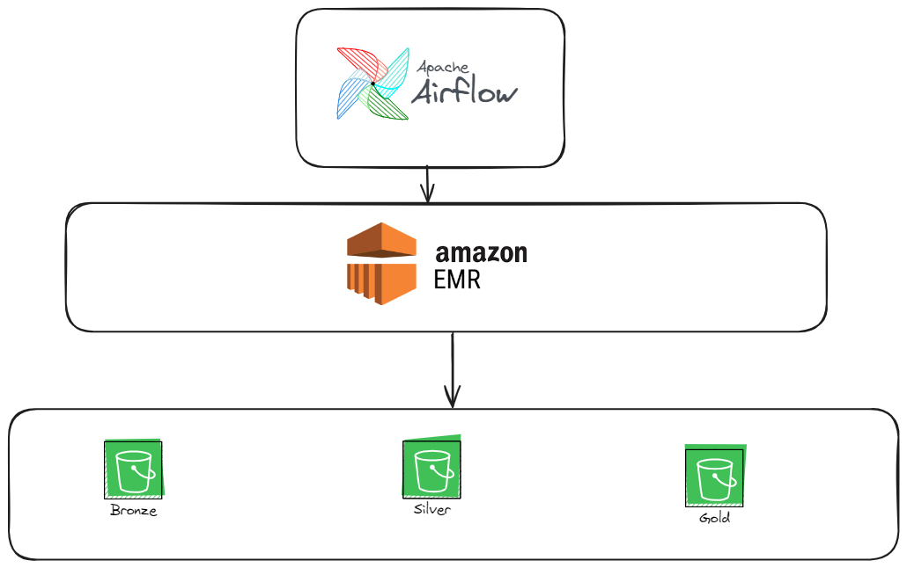

# Projeto: Plataforma de Ingestão de Dados

## Visão Geral

A **Plataforma de Ingestão de Dados** tem como objetivo coletar, processar e armazenar dados da API [openbrewerydb](https://www.openbrewerydb.org/) em uma infraestrutura de dados centralizada para análises, relatórios e visualizações. O sistema será escalável e pode ser executado localmente ou na nuvem.

## Objetivos

1. **Automatização do processo de ingestão de dados**: Permitir que os dados sejam automaticamente extraídos e carregados no Data Lake.
2. **Suporte a múltiplas fontes de dados**: Integrar com APIs, bancos de dados, arquivos CSV, JSON, logs e outros.
3. **Transformação de dados**: Aplicar transformações durante o processo de ingestão (limpeza, agregação, etc.).
4. **Escalabilidade e Resiliência**: Capacidade de lidar com grandes volumes de dados e garantir alta disponibilidade.
5. **Monitoramento e Alertas**: Fornecer mecanismos de monitoramento e alertas para falhas na ingestão.

## Arquitetura

A arquitetura da plataforma de ingestão de dados segue uma abordagem em pipeline, organizada nas seguintes camadas:



### 1. **Fonte de Dados**

- APIs REST [openbrewerydb](https://www.openbrewerydb.org/)

### 2. **Camada de Ingestão**

A camada de ingestão é responsável por coletar dados das fontes e prepará-los para o pipeline de processamento.

#### Ferramentas e Tecnologias:
- **Airflow no EC2 ou em Docker local** : Orquestração dos pipelines.
- **EMR Serverless** : Para executar os scripts Python para extração dos dados da Fonte e Salvar no Datalake.

### 3. **Camada de Processamento**

Nesta etapa, os dados são transformados em formato delta lake.

#### Ferramentas e Tecnologias:
- **PySpark - EMR Serverless**: Para scripts de transformação e manipulação de dados.
- **Airflow no EC2 ou em Docker local** : Orquestração dos pipelines.

### 4. **Armazenamento**

Os dados processados serão armazenados em nos repositórios S3 pertencentes ao Datalake:

- **prod-brz-datalake**: Para armazenamento bruto e arquivos históricos.
- **prod-silver-datalake** : Dados transformados nas tabelas Delta.
- **prod-gold-datalake** : Dados agregados e filtrados para gerações de visões de características específicas do dado.
  
### 5. **Camada de Monitoramento - Futura Implementação**

Monitoramento contínuo para garantir que o pipeline de ingestão esteja funcionando corretamente e que falhas sejam tratadas rapidamente.

#### Ferramentas:
- **Prometheus/Grafana**: Monitoramento e visualização de métricas de performance. Também pode ser considerado o uso de ferramentas pagas como DataDog.
- **Alerting (PagerDuty,Slack)**: Notificações de retries e alertas sobre falha das DAGs. Possível uso do Pager Duty para processos críticos em que precise ser alertado ASAP.
- **Logs enviados para email** : Notificações de retries e alertas sobre falha das DAGs.


## Roadmap
Primeiramente, se você não possui o aws-cli instalado, faça o download e a configuração previamente
1. **Fase 1: Criação dos Recursos e Implementação da infraestrutura do Airflow EC2 ou Airflow local**
     ```bash
      # Executar terraform plan para verificar os recursos que serão criados
      terraform plan
    
     # Executar terraform apply para criar os recursos
     terraform apply
   
      # Assim que o terraform for executado alguns outputs como DNS público, IP público da instância EC2 e a EMR role criada serão apresentados na tela. Substituir o EMR role nos arquivos ymls criados

  Se você optar por executar o Airflow localmente, comente o código da instância EC2, criação de security group e chave ssh.
  Siga os passos de execução dessa [documentação do Airflow](https://airflow.apache.org/docs/apache-airflow/stable/howto/docker-compose/index.html)
  
2. **Fase 2: Copiar Dags e Arquivos pro S3**
   - Copie os códigos Spark para o bucket prod-artifacts-datalake na pasta jobs
   - Copie as DAGs para a pasta em que o Airflow está configurado. Para a instância EC2 utilize o ssh para copiar os arquivos para dentro da instância criada.
   - Ative as DAGs anativas e acompanhe o processo de transição

3. **Fase 3: Monitoramento e Alertas**
   - Nessa fase ainda não foram implementados alertas. Um possível alerta simples de ser implementado futuramente é a conexão com o Slack para aviso de falhas nos pipelines.

4. **Fase 4: Escalabilidade e Otimização**
   - É possível alterar todos os atributos das DAGs pelos arquivos yml, inclusive adicionar novos pipelines, aumentar infraestrutura, lidar com dependências entre as DAGs.

## Conclusão

Este projeto oferece uma solução completa para a ingestão de dados, garantindo escalabilidade e flexibilidade para diferentes fontes e tipos de dados. Através da combinação de ferramentas modernas de ingestão e processamento, a plataforma proporcionará um pipeline capaz de atender às necessidades de análise de dados.
